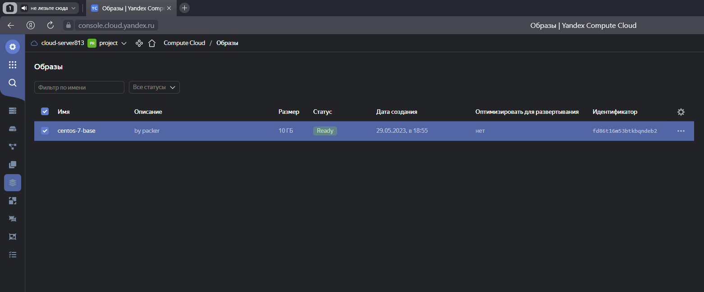
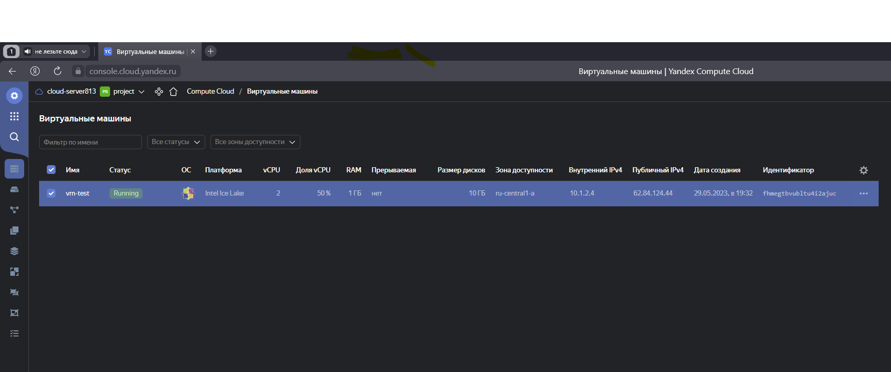

# Домашнее задание к занятию 5.4. "Оркестрация группой Docker-контейнеров на примере Docker Compose"

***

## Задание 1

*Создайте собственный образ любой операционной системы  с помощью Packer (инструкция)*.

<details><summary><b>Сценарий выполнения задания 1 :</b></summary>

```shell
netology@deb11-vm1:~$ yc vpc network create --name network-vpc --labels my-label=netology --description "My network"
id: enpmmf5psu3cpo130b6m
folder_id: b1gpok0ichaplcklr1ve
created_at: "2023-05-25T15:51:22Z"
name: network-vpc
description: My network
labels:
  my-label: netology

netology@deb11-vm1:~$ yc vpc subnet create --name my-subnet-a --zone ru-central1-a --range 10.1.2.0/24 --network-net network-vpc --description "My-subnet"
ERROR: unknown flag: --network-net
netology@deb11-vm1:~$ yc vpc subnet create --name my-subnet-a --zone ru-central1-a --range 10.1.2.0/24 --network-name network-vpc --description "My-subnet"
id: e9b40kdedhfbrfndr94e
folder_id: b1gpok0ichaplcklr1ve
created_at: "2023-05-25T15:56:48Z"
name: my-subnet-a
description: My-subnet
network_id: enpmmf5psu3cpo130b6m
zone_id: ru-central1-a
v4_cidr_blocks:
  - 10.1.2.0/24

netology@deb11-vm1:~/yandex-cloud$ packer validate debian11.json
The configuration is valid.
netology@deb11-vm1:~/yandex-cloud$ sudo packer build debian11.json
yandex: output will be in this color.

==> yandex: Creating temporary RSA SSH key for instance...
==> yandex: Using as source image: fd89dg1rq7uqslc6eigm (name: "debian-11-v20230522", family: "debian-11")
==> yandex: Use provided subnet id e9b40kdedhfbrfndr94e
==> yandex: Creating disk...
==> yandex: Creating instance...
==> yandex: Waiting for instance with id fhmrntddebdhpsjqaeqe to become active...
    yandex: Detected instance IP: 158.160.102.137
==> yandex: Using SSH communicator to connect: 158.160.102.137
==> yandex: Waiting for SSH to become available...
==> yandex: Connected to SSH!
==> yandex: Provisioning with shell script: /tmp/packer-shell2379814482

...
==> yandex: Stopping instance...
==> yandex: Deleting instance...
    yandex: Instance has been deleted!
==> yandex: Creating image: debian-11-nginx-2023-05-27t10-29-37z
==> yandex: Waiting for image to complete...
==> yandex: Success image create...
==> yandex: Destroying boot disk...
    yandex: Disk has been deleted!
Build 'yandex' finished after 3 minutes 31 seconds.

==> Wait completed after 3 minutes 31 seconds

==> Builds finished. The artifacts of successful builds are:
--> yandex: A disk image was created: debian-11-nginx-2023-05-27t10-29-37z (id: fd8ies1oodo9sue03vih) with family name debian-web-server
netology@deb11-vm1:~/yandex-cloud$ yc compute image list
+----------------------+--------------------------------------+-------------------+----------------------+--------+
|          ID          |                 NAME                 |      FAMILY       |     PRODUCT IDS      | STATUS |
+----------------------+--------------------------------------+-------------------+----------------------+--------+
| fd8ies1oodo9sue03vih | debian-11-nginx-2023-05-27t10-29-37z | debian-web-server | f2eu5sakphet32oa2ss7 | READY  |
+----------------------+--------------------------------------+-------------------+----------------------+--------+

```
</details>

[debian11.json](./src/504/packer)

*Чтобы получить зачёт, вам нужно предоставить скриншот страницы с созданным образом из личного кабинета YandexCloud*.
<div style="width:auto ; height:250px">



</div>

***

## Задание 2

2.1. *Создайте вашу первую виртуальную машину в YandexCloud с помощью web-интерфейса YandexCloud*.

<div style="width:auto ; height:250px">



</div>

2.2.* (**Необязательное задание**)

*Создайте вашу первую виртуальную машину в YandexCloud с помощью Terraform* (*вместо использования веб-интерфейса* YandexCloud).   
*Используйте Terraform-код в директории* ([src/terraform](./src/504/terraform)).

*Чтобы получить зачёт, вам нужно предоставить вывод команды terraform apply и страницы свойств, созданной ВМ из личного кабинета YandexCloud*

<div style="width:auto ; height:250px">


</div>

<details><summary><b>Сценарий выполнения задания 2.2 :</b></summary>

```shell
netology@deb11-vm1:~/terraform$ terraform apply

Terraform used the selected providers to generate the following execution plan. Resource actions are indicated with the following symbols:
  + create

Terraform will perform the following actions:

  # yandex_compute_instance.node01 will be created
  + resource "yandex_compute_instance" "node01" {
      + allow_stopping_for_update = true
      + created_at                = (known after apply)
      + folder_id                 = (known after apply)
      + fqdn                      = (known after apply)
      + gpu_cluster_id            = (known after apply)
      + hostname                  = "node01.netology.cloud"
      + id                        = (known after apply)
      + metadata                  = {
          + "ssh-keys" = <<-EOT
                debian11:ssh-rsa AAAAB3NzaC1yc2EAAAADAQABAAABgQC0TmsFvjPzXlZI3r2qV7fTia5D2m0JTyTCZtnplJx2EMJCBKV4awQOiXwzeCZC/pRXuA4Mr/hR9FaR8fKYQH7okwJjXOCaUDawaEvRN5PefuyqulkNtsLFI0p+KrY3UJZTHmt+AyZXBRP0hfu+ucRhXYRvxAfGClDfc5xtOwAyTmO07dobCHvWy1WLGd2HjicGgZQkClZRdc83LMvN19VzPN6KF9Qg8fpqWalBuClmXKj81qblQVUXjt92531wrBiBC/mucCLpDb/qtFsvVOomtNr7ctBW6vGEFafIn9YNf3giTHD7V+cQLhH8FBBlRiNQVrBdPuZY2WYe3WSTIGoR780rSKLWBTH362yHSIZGDb2MfxgV/KKWrNff4SGsW4q2soXUVa53807sCG5PRqFUCgc8NbP0d8BURGb7vW+LQGElbnHy3u866KqyAnZ9Ru3JmoiNASjH+6Bkr+iofOTK555Lvxj5ru1JGHPNhiSh6KfJ3lDA2qPdwVwWb0Tq9JU= netology@deb11-vm1
            EOT
        }
      + name                      = "node01"
      + network_acceleration_type = "standard"
      + platform_id               = "standard-v1"
      + service_account_id        = (known after apply)
      + status                    = (known after apply)
      + zone                      = "ru-central1-a"

      + boot_disk {
          + auto_delete = true
          + device_name = (known after apply)
          + disk_id     = (known after apply)
          + mode        = (known after apply)

          + initialize_params {
              + block_size  = (known after apply)
              + description = (known after apply)
              + image_id    = "fd8i2392nkt3gdailt4k"
              + name        = "root-node01"
              + size        = 50
              + snapshot_id = (known after apply)
              + type        = "network-nvme"
            }
        }

      + network_interface {
          + index              = (known after apply)
          + ip_address         = (known after apply)
          + ipv4               = true
          + ipv6               = (known after apply)
          + ipv6_address       = (known after apply)
          + mac_address        = (known after apply)
          + nat                = true
          + nat_ip_address     = (known after apply)
          + nat_ip_version     = (known after apply)
          + security_group_ids = (known after apply)
          + subnet_id          = (known after apply)
        }

      + resources {
          + core_fraction = 100
          + cores         = 8
          + memory        = 8
        }
    }

  # yandex_vpc_network.network-vpc will be created
  + resource "yandex_vpc_network" "network-vpc" {
      + created_at                = (known after apply)
      + default_security_group_id = (known after apply)
      + folder_id                 = (known after apply)
      + id                        = (known after apply)
      + labels                    = (known after apply)
      + name                      = "network-vpc"
      + subnet_ids                = (known after apply)
    }

  # yandex_vpc_subnet.subnet-vpc will be created
  + resource "yandex_vpc_subnet" "subnet-vpc" {
      + created_at     = (known after apply)
      + folder_id      = (known after apply)
      + id             = (known after apply)
      + labels         = (known after apply)
      + name           = "subnet"
      + network_id     = (known after apply)
      + v4_cidr_blocks = [
          + "10.1.2.0/24",
        ]
      + v6_cidr_blocks = (known after apply)
      + zone           = "ru-central1-a"
    }

Plan: 3 to add, 0 to change, 0 to destroy.

Changes to Outputs:
  + external_ip_address_node01_yandex_cloud = (known after apply)
  + internal_ip_address_node01_yandex_cloud = (known after apply)

Do you want to perform these actions?
  Terraform will perform the actions described above.
  Only 'yes' will be accepted to approve.

  Enter a value: yes

yandex_vpc_network.network-vpc: Creating...
yandex_vpc_network.network-vpc: Creation complete after 2s [id=enp88vi2jtjgain0qco7]
yandex_vpc_subnet.subnet-vpc: Creating...
yandex_vpc_subnet.subnet-vpc: Creation complete after 0s [id=e9bmjf83fa9eg4eu4os0]
yandex_compute_instance.node01: Creating...
yandex_compute_instance.node01: Still creating... [10s elapsed]
yandex_compute_instance.node01: Still creating... [20s elapsed]
yandex_compute_instance.node01: Still creating... [30s elapsed]
yandex_compute_instance.node01: Still creating... [40s elapsed]
yandex_compute_instance.node01: Still creating... [50s elapsed]
yandex_compute_instance.node01: Creation complete after 51s [id=fhm8djv3u1hcvq9nuhql]

Apply complete! Resources: 3 added, 0 changed, 0 destroyed.

Outputs:

external_ip_address_node01_yandex_cloud = "158.160.60.133"
internal_ip_address_node01_yandex_cloud = "10.1.2.19"

netology@deb11-vm1:~/terraform$ ssh debian@158.160.60.133
The authenticity of host '158.160.60.133 (158.160.60.133)' can't be established.
ECDSA key fingerprint is SHA256:Xw5QIeyBdkkgmdehNh6jtjabHjYmlX9GES8Bk4O53Go.
Are you sure you want to continue connecting (yes/no/[fingerprint])? yes
Warning: Permanently added '158.160.60.133' (ECDSA) to the list of known hosts.
Linux node01 5.10.0-19-amd64 #1 SMP Debian 5.10.149-2 (2022-10-21) x86_64

The programs included with the Debian GNU/Linux system are free software;
the exact distribution terms for each program are described in the
individual files in /usr/share/doc/*/copyright.

Debian GNU/Linux comes with ABSOLUTELY NO WARRANTY, to the extent
permitted by applicable law.

debian@node01:~$ hostnamectl
   Static hostname: node01
         Icon name: computer-vm
           Chassis: vm
        Machine ID: 9b1ae59595a8444db59f93afd95e7629
           Boot ID: f46377dac7d34e42a10eb77d05df3384
    Virtualization: kvm
  Operating System: Debian GNU/Linux 11 (bullseye)
            Kernel: Linux 5.10.0-19-amd64
      Architecture: x86-64

debian@node01:~$ 

```

</details>

***

## Задание 3

*С помощью Ansible и Docker Compose разверните на виртуальной машине из предыдущего задания систему мониторинга на основе Prometheus/Grafana. Используйте Ansible-код в директории ([src/ansible](./src/504/ansible))*.

*Чтобы получить зачёт, вам нужно предоставить вывод команды* `docker ps` , *все контейнеры, описанные в [docker-compose](./src/ansible/stack), должны быть в статусе* `Up`.

***

## Задание 4

1. *Откройте веб-браузер, зайдите на страницу* http://<внешний_ip_адрес_вашей_ВМ>:3000.
2. *Используйте для авторизации логин и пароль из .env-file*.
3. *Изучите доступный интерфейс, найдите в интерфейсе автоматически созданные docker-compose-панели с графиками(dashboards)*.
4. *Подождите 5-10 минут, чтобы система мониторинга успела накопить данные*.

*Чтобы получить зачёт, предоставьте*:

+ *скриншот работающего веб-интерфейса* **Grafana** *с текущими метриками*

***

## Задание 5(*)

*Создайте вторую ВМ и подключите её к мониторингу, развёрнутому на первом сервере*.

*Чтобы получить зачёт, предоставьте*:
 
+ *скриншот из Grafana, на котором будут отображаться метрики добавленного вами сервера*.
