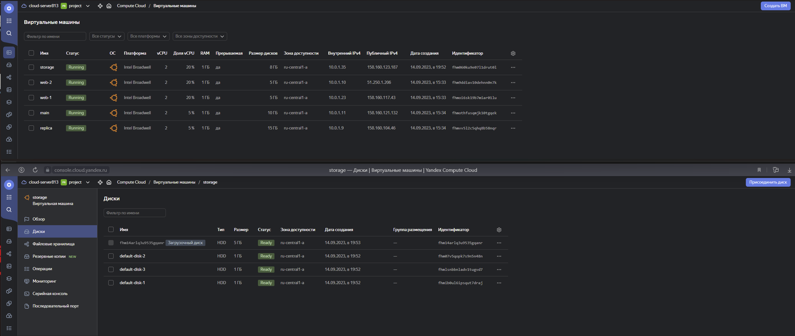

# Домашнее задание к занятию 7.3 «Управляющие конструкции в коде Terraform»

<details><summary><b>Цели задания</b></summary>

1. Отработать основные принципы и методы работы с управляющими конструкциями Terraform.
2. Освоить работу с шаблонизатором Terraform (Interpolation Syntax).

</details>

<details><summary><b>Чек-лист готовности к домашнему заданию</b></summary>

1. Зарегистрирован аккаунт в Yandex Cloud. Использован промокод на грант.
2. Установлен инструмент Yandex CLI.
3. Доступен исходный код для выполнения задания в директории [**03/src**](https://github.com/sergey-vs/DevOps-netology/tree/main/03-ter-homeworks/src/303).
4. Любые ВМ, использованные при выполнении задания, должны быть прерываемыми, для экономии средств.

</details>

### Инструменты и дополнительные материалы, которые пригодятся для выполнения задания

1. [Консоль управления Yandex Cloud](https://console.cloud.yandex.ru/folders/<cloud_id>/vpc/security-groups).
2. [Группы безопасности](https://cloud.yandex.ru/docs/vpc/concepts/security-groups?from=int-console-help-center-or-nav).
3. [Datasource compute disk](https://terraform-eap.website.yandexcloud.net/docs/providers/yandex/d/datasource_compute_disk.html).

***

## Задание 1

 1. Изучите проект.
 2. Заполните файл personal.auto.tfvars.
 3. Инициализируйте проект, выполните код. Он выполнится, даже если доступа к preview нет.
Примечание. Если у вас не активирован preview-доступ к функционалу «Группы безопасности» в Yandex Cloud, запросите доступ у поддержки облачного провайдера. Обычно его выдают в течение 24-х часов.

Приложите скриншот входящих правил «Группы безопасности» в ЛК Yandex Cloud или скриншот отказа в предоставлении доступа к preview-версии.

<details><summary><b>ЛК Yandex Cloud «Группы безопасности»</b></summary>


</details>

***

### Задание 2

1. Создайте файл count-vm.tf. Опишите в нём создание двух **одинаковых** ВМ  **web-1** и **web-2** (не web-0 и web-1) с минимальными параметрами, используя мета-аргумент **count loop**. Назначьте ВМ созданную в первом задании группу безопасности.(как это сделать узнайте в документации провайдера yandex/compute_instance )

<details><summary><b>count-vm.tf.</b></summary>

```tf

#создаем 2 идентичные ВМ
resource "yandex_compute_instance" "first_server" {
  name        = "web-${count.index + 1}"
  platform_id = "standard-v1"
  
  count = 2

  resources {
    cores  = var.vm_resources.cores
    memory = var.vm_resources.memory
    core_fraction = var.vm_resources.core_fraction
  }

  boot_disk {
    initialize_params {
      image_id = data.yandex_compute_image.ubuntu.image_id
    }
  }

  scheduling_policy {
    preemptible = true
  }

  network_interface {
    subnet_id = yandex_vpc_subnet.develop.id
    nat       = true
  }

  metadata = local.ssh_keys_and_serial_port  
}
```
</details>

2. Создайте файл for_each-vm.tf. Опишите в нём создание двух ВМ с именами "main" и "replica" **разных** по cpu/ram/disk , используя мета-аргумент **for_each loop**. Используйте для обеих ВМ одну общую переменную типа list(object({ vm_name=string, cpu=number, ram=number, disk=number  })). При желании внесите в переменную все возможные параметры.
. ВМ из пункта 2.2 должны создаваться после создания ВМ из пункта 2.1.

<details><summary><b>for_each-vm.tf.</b></summary>

```tf
resource "yandex_compute_instance""second_server" {
  for_each = {
    for key,value in var.vms:
    key => value
  }

  name        = each.value.vm_name
  platform_id = "standard-v1"
  resources {
    cores         = each.value.cpu
    memory        = each.value.ram
    core_fraction = each.value.core_fraction
  }


boot_disk {
  initialize_params {
      image_id = data.yandex_compute_image.ubuntu.image_id
      size     = each.value.disk_size
    }
}  

scheduling_policy {
  preemptible = true
  }
network_interface {
  subnet_id = yandex_vpc_subnet.develop.id
  nat       = true
}

metadata = local.ssh_keys_and_serial_port

 depends_on = [
    yandex_compute_instance.first_server
  ]

}
```
</details>

3. Используйте функцию file в local-переменной для считывания ключа ~/.ssh/id_rsa.pub и его последующего использования в блоке metadata, взятому из ДЗ 2.

<details><summary><b>locals.tf</b></summary>

```tf
locals {
    ssh_keys_and_serial_port      = {
    ssh-keys                      = "ubuntu:${file("~/.ssh/id_ed25519.pub")}"
    serial-port-enable            = "1"
 }
}
```
</details>

4. Инициализируйте проект, выполните код

<details><summary><b>ЛК Yandex Cloud с созданными ВМ</b></summary>


</details>

<details><summary><b>Подключения к консоли ВМ через ssh</b></summary>

```bash
┌──(sergey㉿kali)-[~/terraform/hw_ter2]
└─$ ssh ubuntu@51.250.1.206
The authenticity of host '51.250.1.206 (51.250.1.206)' can't be established.
ED25519 key fingerprint is SHA256:k0tuXwS/gR9y5+u86hWcZQYljbSHwyRfG/eCf2ReSEE.
This key is not known by any other names.
Are you sure you want to continue connecting (yes/no/[fingerprint])? yes
Warning: Permanently added '51.250.1.206' (ED25519) to the list of known hosts.
Welcome to Ubuntu 20.04.6 LTS (GNU/Linux 5.4.0-162-generic x86_64)

 * Documentation:  https://help.ubuntu.com
 * Management:     https://landscape.canonical.com
 * Support:        https://ubuntu.com/advantage

The programs included with the Ubuntu system are free software;
the exact distribution terms for each program are described in the
individual files in /usr/share/doc/*/copyright.

Ubuntu comes with ABSOLUTELY NO WARRANTY, to the extent permitted by
applicable law.

To run a command as administrator (user "root"), use "sudo <command>".
See "man sudo_root" for details.

ubuntu@fhm9ddiav10dehnn0n7k:~$ uname -a
Linux fhm9ddiav10dehnn0n7k 5.4.0-162-generic #179-Ubuntu SMP Mon Aug 14 08:51:31 UTC 2023 x86_64 x86_64 x86_64 GNU/Linux
ubuntu@fhm9ddiav10dehnn0n7k:~$ exit
logout
Connection to 51.250.1.206 closed.

┌──(sergey㉿kali)-[~/terraform/hw_ter2]
└─$
 
```

</details>

***

### Задание 3

1. Создайте 3 одинаковых виртуальных диска размером 1 Гб с помощью ресурса yandex_compute_disk и мета-аргумента count в файле **disk_vm.tf** .

<details><summary><b>disk_vm.tf</b></summary>

```tf
resource "yandex_compute_disk" "default_disk" {
  count      = 3
  name       = "default-disk-${count.index + 1}"
  type       = "network-hdd"
  zone       = var.default_zone
  size       = 1
  block_size = 4096
}

resource "yandex_compute_instance" "storage_server" {

    depends_on = [yandex_compute_disk.default_disk]

  name        = "storage"
  platform_id = "standard-v1"

  resources {
    cores         = var.vm_resources.cores
    memory        = var.vm_resources.memory
    core_fraction = var.vm_resources.core_fraction
  }

boot_disk {
    initialize_params {
      image_id = data.yandex_compute_image.ubuntu.image_id
    }
  }

  dynamic "secondary_disk" {
    for_each = toset(yandex_compute_disk.default_disk[*].id)
    content {
      disk_id     = secondary_disk.key
      auto_delete = true
    }
  }

metadata = local.ssh_keys_and_serial_port

scheduling_policy {
    preemptible = true
  }

   network_interface {
    subnet_id = yandex_vpc_subnet.develop.id
    nat       = true
  }

 allow_stopping_for_update = true

}
```

</details>

2. Создайте в том же файле одну ВМ c именем "storage" . Используйте блок **dynamic secondary_disk{..}** и мета-аргумент for_each для подключения созданных вами дополнительных дисков.

<details><summary><b>ЛК Yandex Cloud с созданной ВМ</b></summary>



</details>

***

### Задание 4

1. В файле ansible.tf создайте inventory-файл для ansible.
Используйте функцию tepmplatefile и файл-шаблон для создания ansible inventory-файла из лекции.
Готовый код возьмите из демонстрации к лекции [**demonstration2**](https://github.com/sergey-vs/DevOps-netology/tree/main/03-ter-homeworks/src/303/demonstration)).
Передайте в него в качестве переменных группы виртуальных машин из задания 2.1, 2.2 и 3.2, т. е. 5 ВМ.
2. Инвентарь должен содержать 3 группы [webservers], [databases], [storage] и быть динамическим, т. е. обработать как группу из 2-х ВМ, так и 999 ВМ.
4. Выполните код. Приложите скриншот получившегося файла. 

<details><summary><b>ansible.tf</b></summary>

```tf
resource "local_file" "hosts_cfg" {
  content = templatefile("${path.module}/hosts.tftpl",
    {
      webservers = yandex_compute_instance.second_server
      databases  = yandex_compute_instance.first_server
      storage    = [yandex_compute_instance.storage_server]
    }
  )
  filename = "${abspath(path.module)}/hosts.cfg"
}
```

</details>

<details><summary><b>hosts.cfg</b></summary>

```cfg
[webservers]
main   ansible_host=158.160.121.132
replica   ansible_host=158.160.104.46

[databases]
web-1   ansible_host=158.160.117.43
web-2   ansible_host=51.250.1.206

[storage]
storage   ansible_host=158.160.123.187
```
</details>

<details><summary><b>hosts.tftpl</b></summary>

```tftpl
[webservers]

%{~ for i in webservers ~}
${i["name"]}   ansible_host=${i["network_interface"][0]["nat_ip_address"]}

%{~ endfor ~}

[databases]

%{~ for i in databases ~}
${i["name"]}   ansible_host=${i["network_interface"][0]["nat_ip_address"]}

%{~ endfor ~}

[storage]

%{~ for i in storage ~}
${i["name"]}   ansible_host=${i["network_interface"][0]["nat_ip_address"]}

%{~ endfor ~}
```
</details>


Для общего зачёта создайте в вашем GitHub-репозитории новую ветку terraform-03. Закоммитьте в эту ветку свой финальный код проекта, пришлите ссылку на коммит.   
**Удалите все созданные ресурсы**.

***

## Дополнительные задания (со звездочкой*)

**Настоятельно рекомендуем выполнять все задания со звёздочкой.** Они помогут глубже разобраться в материале.   
Задания со звёздочкой дополнительные, не обязательные к выполнению и никак не повлияют на получение вами зачёта по этому домашнему заданию. 

### Задание 5* (необязательное)
1. Напишите output, который отобразит все 5 созданных ВМ в виде списка словарей:

```tf
[
 {
  "name" = 'имя ВМ1'
  "id"   = 'идентификатор ВМ1'
  "fqdn" = 'Внутренний FQDN ВМ1'
 },
 {
  "name" = 'имя ВМ2'
  "id"   = 'идентификатор ВМ2'
  "fqdn" = 'Внутренний FQDN ВМ2'
 },
 ....
]

```

Приложите скриншот вывода команды `terrafrom output` .

***

### Задание 6* (необязательное)

 1. Используя null_resource и local-exec, примените ansible-playbook к ВМ из ansible inventory-файла.
 Готовый код возьмите из демонстрации к лекции [**demonstration2**](https://github.com/sergey-vs/DevOps-netology/tree/main/03-ter-homeworks/src/303/demonstration).
 3. Дополните файл шаблон hosts.tftpl. 
 Формат готового файла:
 ```netology-develop-platform-web-0   ansible_host="<внешний IP-address или внутренний IP-address если у ВМ отсутвует внешний адрес>"```

Для проверки работы уберите у ВМ внешние адреса. Этот вариант используется при работе через bastion-сервер.
Для зачёта предоставьте код вместе с основной частью задания.
